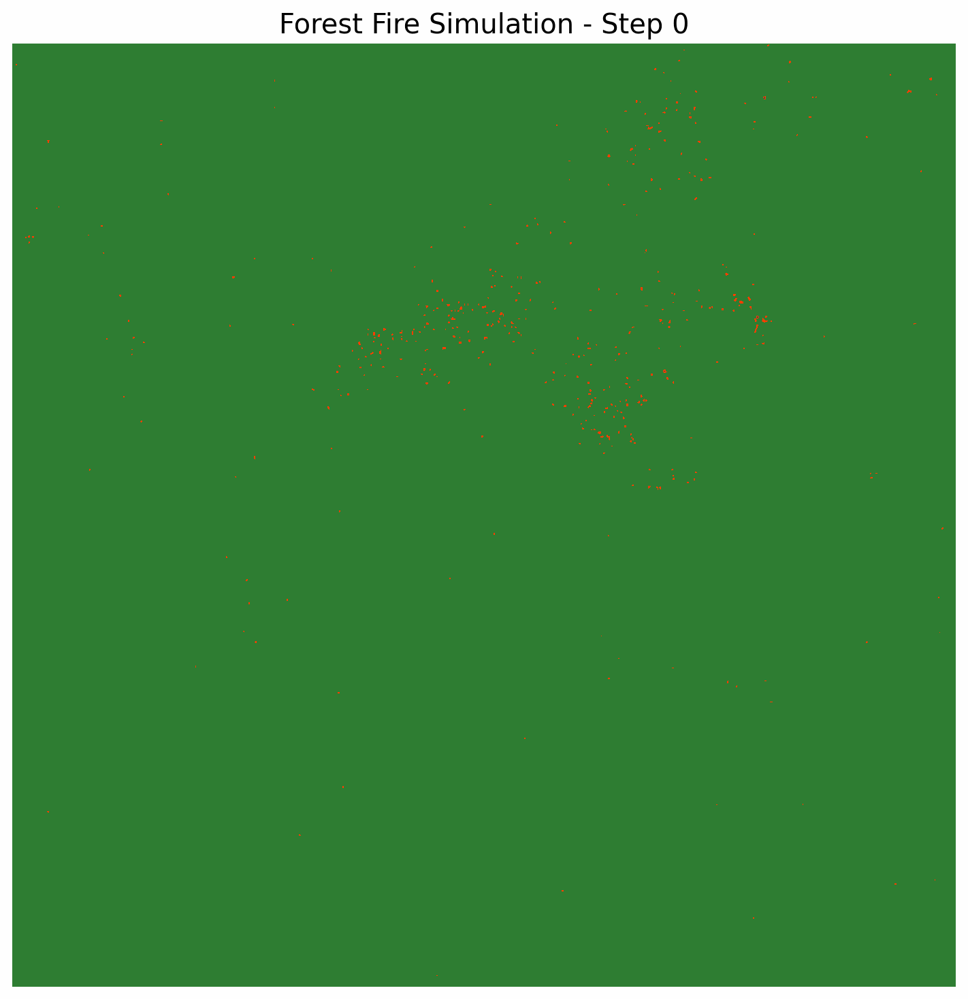

#  Exercise 3 — Forest Fire Simulation

Models forest fire spread as a cellular automaton on a 2D grid, seeded with real satellite hotspot data from the NASA FIRMS API (VIIRS\_NOAA20\_NRT instrument). The simulation covers a region in West Africa (Mauritania, Mali, and Senegal), using 768 hotspot detections over a two-day window as initial ignition points.

Each cell holds one of four states: empty (0), vegetation (1), burning (2), or burned (3). At each time step, a burning cell can ignite any of its 8 neighbors (Moore neighborhood) with probability p = 0.45, then transitions to burned.

The serial baseline iterates over the full grid sequentially. The parallel version uses MPI row-based domain decomposition — the grid is split into horizontal strips per process, with ghost row exchange via `MPI.Sendrecv` at every step to maintain boundary consistency.

Results are visualized as a frame-by-frame animation and a final state map.

## Model Parameters

| Parameter | Value |
|---|---|
| Grid sizes tested | 500×500, 1000×1000, 1500×1500 |
| Time steps | 150 |
| Spread probability | 0.45 |
| Neighborhood | Moore (8 neighbors) |
| Data source | VIIRS\_NOAA20\_NRT — 768 hotspots |
| Region | West Africa [18°N–28°N, 14°W–4°W] |

## Results

| Implementation | Grid | Processes | Time (s) | Speedup |
|---|---|---|---|---|
| Serial | 1500 × 1500 | 1 | 4.46 | 1.00x |
| MPI | 1500 × 1500 | 2 | 3.23 | 1.38x |
| MPI | 1500 × 1500 | 4 | 2.04 | 2.19x |

Sub-linear speedup is expected due to ghost row communication overhead between processes.

## Simulation Output

---

For further details, see the full report at `docs/report.pdf`.